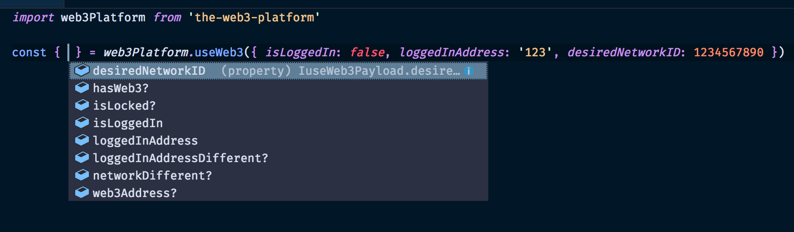

# The Web3 Platform

Web3 API's turned into React Hooks. #useTheWeb3Platform

## Install

> Note: React 16.7+ is required for Hooks.

### With npm

```sh
npm i the-web3-platform --save
```

### Or with yarn

```sh
yarn add the-web3-platform
```

#### useWeb3 hook Example


